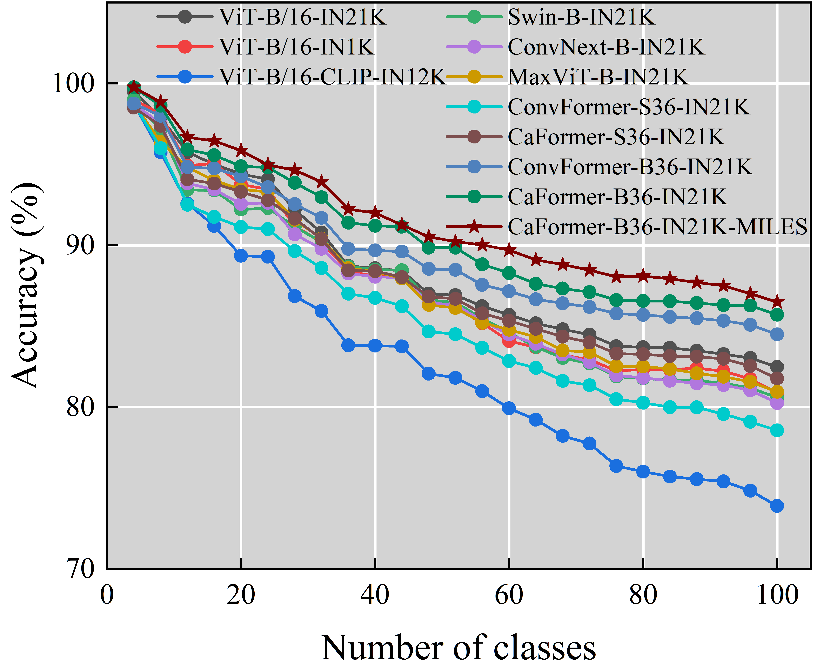
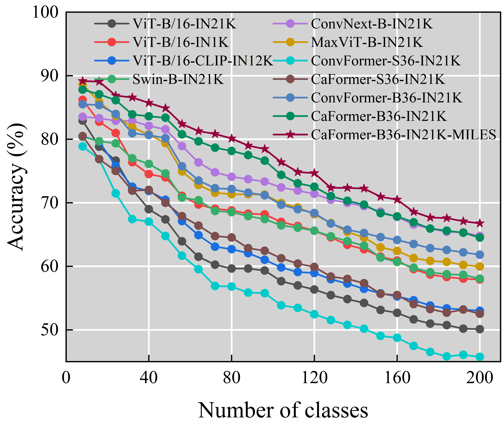
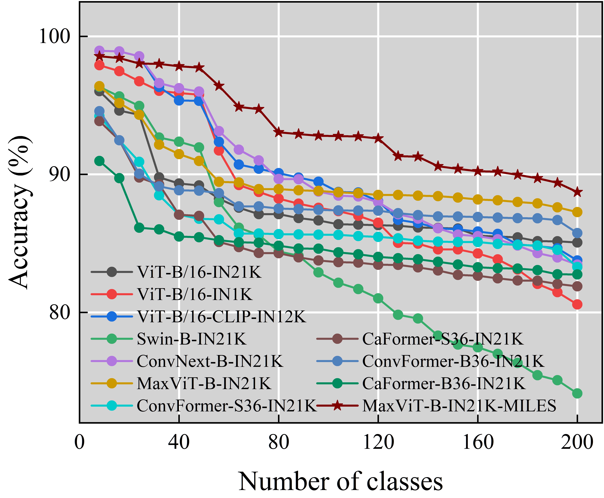
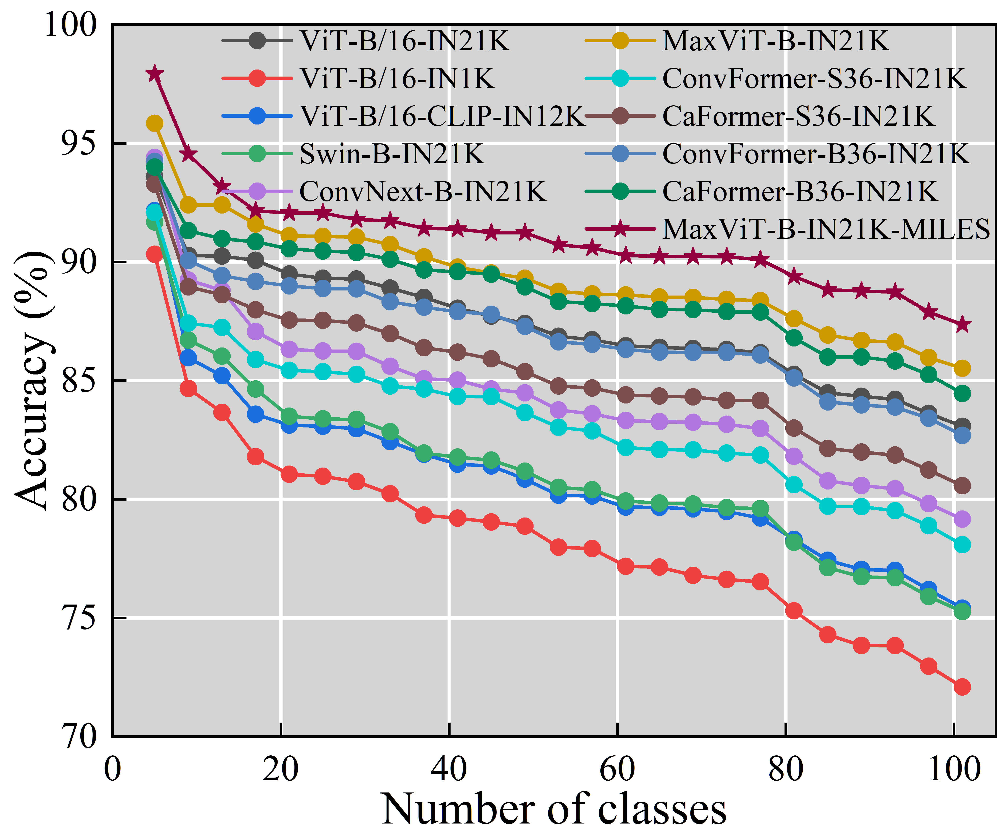
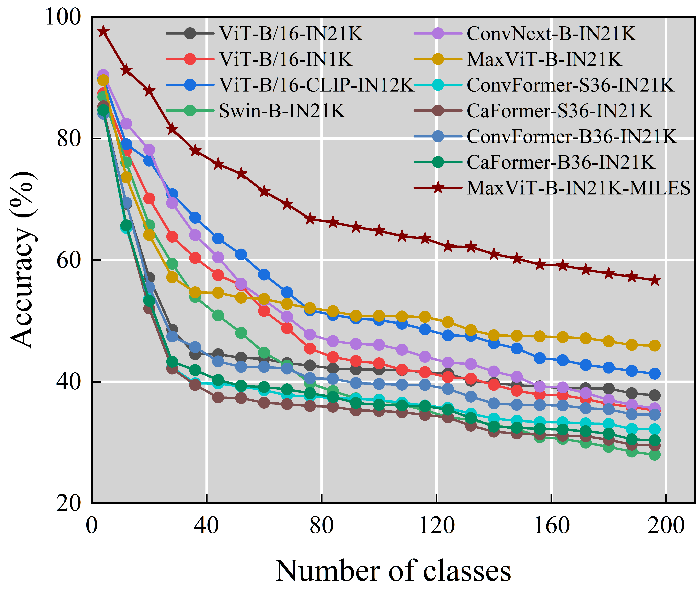

# MILES
A new SOTA methods for pre-trained model-based CIL! This is the open source repository for MILES, i.e., MetrIc Learning with Expanable Subspace.

*2024.11.21* We test various backbone networks in SimpleML and MILES! The results are as follow:
| CIFAR-100 | ImageNet-A| Omnibenchmark |
|-------|-------|-------|
|  |  |  |

| CUB | FOOD-101 | CARS-196 |
|-------|-------|-------|
|  |  |  |

# Preliminary
Before reproducing our experiments, you should prepare two things:
1. Data.
2. Pre-traind backbone.
## Data
Six datasets are included in our experiments, i.e., CIFAR-100, ImageNet-A, Omnibenchmark, CUB-200, FOOD-101 and CARS-196.
1. **CIFAR-100**: it will be automatically downloaded by the code.
2. **ImageNet-A**: Onedrive: [link](https://entuedu-my.sharepoint.com/personal/n2207876b_e_ntu_edu_sg/_layouts/15/onedrive.aspx?id=%2Fpersonal%2Fn2207876b%5Fe%5Fntu%5Fedu%5Fsg%2FDocuments%2FRevisitingCIL%2Fina%2Ezip&parent=%2Fpersonal%2Fn2207876b%5Fe%5Fntu%5Fedu%5Fsg%2FDocuments%2FRevisitingCIL&ga=1)
3. **Omnibenchmark**: Onedrive: [link](https://entuedu-my.sharepoint.com/personal/n2207876b_e_ntu_edu_sg/_layouts/15/onedrive.aspx?id=%2Fpersonal%2Fn2207876b%5Fe%5Fntu%5Fedu%5Fsg%2FDocuments%2FRevisitingCIL%2Fomnibenchmark%2Ezip&parent=%2Fpersonal%2Fn2207876b%5Fe%5Fntu%5Fedu%5Fsg%2FDocuments%2FRevisitingCIL&ga=1)
4. **CUB-200**: AWS: [link](https://s3.amazonaws.com/fast-ai-imageclas/CUB_200_2011.tgz)
5. **FOOD-101**: AWS: [link](https://s3.amazonaws.com/fast-ai-imageclas/food-101.tgz)
6. **CARS-196**: AWS: [link](https://s3.amazonaws.com/fast-ai-imageclas/stanford-cars.tgz)

All links are from open sources. You can download these datasets and put them in the 'data' filefolder. The formats follow ImageFolder.
## Pre-trained backbone
We adopt the **ViT-B/16-IN21K** as the pre-trained model. You can use the **timm** library to obtain the pre-trained weight.

*2024.11.15* We update more kinds of backbones. You can check the './Backbone/Get_backbones.py' to get the supported pre-trained backbones. You only need revise the json file to replace the backbone. If you cannot get the weight of pre-trained models dirrectly by timm library, please access the huggingface to download the weight files, i.e., 'pytorch_model.bin'. Then, you can use 'torch.load()' to initalize the model with the 'pytorch_model.bin'.
## How to reproduce
If the data and pre-trained backbone have been ready, you can just use the command '*sh Reproduce.sh*' to get all results.

# Environment
About the environment,
Main package:
1. torch 2.0.0+cu118,
2. torchvision 0.15.1+cu118,
3. timm 1.0.7,
4. sklearn,
5. tqdm,
6. numpy 1.24.2.

# Notes
We adopt multithreading to load the data into memory. For the training on Omnibenchmark and FOOD-101, you need at least 100GB RAM. If you don't have enough memory, you can modify

*split_images_labels_imagenet(train_dset.imgs)* to *split_images_labels_imagenet(train_dset.imgs, 256)*

and modify

*split_images_labels_imagenet(test_dset.imgs)* to *split_images_labels_imagenet(test_dset.imgs, 256)*

in the *./utils/data.py*.

But it will impair the performance slightly.

# Split datasets
Official CARS-196 files is *.mat* file. You can use the *./utils/split_cars.m* to convert it to ImageFolder format.
